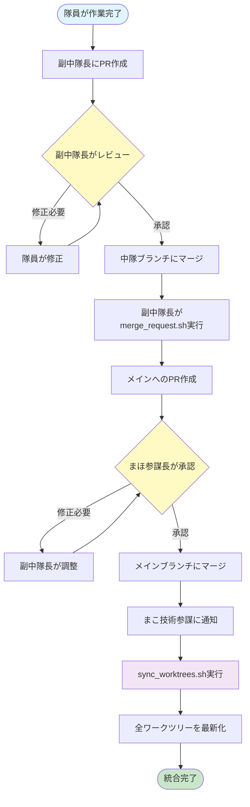

# Git統合フロー

## 概要

本ドキュメントでは、ガルパン・マルチエージェントシステムにおけるGit統合サイクルを説明します。各中隊（Platoon）が並行開発を行い、その成果をメインブランチに統合する一連のフローを定義しています。

## 前提条件

- 各中隊は専用のワークツリー（`worktrees/<platoon>/`）で作業
- ブランチ命名規則: `<platoon>/<feature-name>`（例: `platoon1/login-feature`）
- PR（Pull Request）ベースの統合フロー
- 品質保証のための承認プロセス

---

## Git統合フロー全体図



---

## 各ステップの詳細説明

### STEP 1: 隊員が作業完了 → 副中隊長にPR

**担当**: 中隊メンバー（隊員）

**作業内容**:
1. 自分のワークツリーで機能開発・バグ修正を完了
2. コミットメッセージを明確に記載
3. 中隊ブランチ（例: `platoon1/main`）に対してPRを作成

**チェックリスト**:
- [ ] 未コミットの変更がない
- [ ] テストが通過している（該当する場合）
- [ ] コミットメッセージが明確
- [ ] PRのタイトルと説明が適切

**使用コマンド例**:
```bash
# 変更を確認
git status
git diff

# コミット
git add .
git commit -m "feat: ログイン機能を実装"

# プッシュしてPR作成
git push origin <自分のブランチ>
```

---

### STEP 2: 副中隊長がレビュー → 中隊ブランチにマージ

**担当**: 副中隊長（各中隊の Deputy Leader）

**作業内容**:
1. 隊員からのPRを確認
2. コードレビューを実施
3. 品質基準を満たしていれば、中隊ブランチにマージ

**レビュー観点**:
- コードの品質（可読性、保守性）
- 機能要件を満たしているか
- テストが適切に書かれているか
- 命名規則やコーディング規約に従っているか

**マージ手順**:
```bash
# 中隊ワークツリーに移動
cd worktrees/<platoon>/

# PRをローカルで確認（オプション）
git fetch origin <PR-branch>
git checkout <PR-branch>

# マージ
git checkout <中隊ブランチ>
git merge <PR-branch>
git push origin <中隊ブランチ>
```

---

### STEP 3: 副中隊長がmerge_request.shでメインへPR作成

**担当**: 副中隊長

**作業内容**:
1. 中隊の成果をメインブランチに統合するためのPRを作成
2. `merge_request.sh` スクリプトを使用して自動化

**スクリプト使用手順**:

#### 3-1. マージ可能性をチェック
```bash
./scripts/merge_request.sh check platoon1
```

**チェック内容**:
- 未コミットの変更がないか
- メインブランチとの差分確認
- マージコンフリクトの検出

**出力例**:
```
[INFO] マージ可能性をチェックしています: platoon1

[1/3] 未コミット変更の確認
[SUCCESS] 未コミット変更なし

[2/3] メインブランチとの差分確認
  コミット数（このブランチのみ）: 3
  コミット数（メインのみ）: 0

[3/3] コンフリクト確認
[SUCCESS] コンフリクトなし

[SUCCESS] マージ可能です！

次のステップ:
  ./scripts/merge_request.sh create platoon1 --title "PR タイトル"
```

#### 3-2. PRを作成
```bash
./scripts/merge_request.sh create platoon1 --title "ログイン機能実装"
```

**処理内容**:
1. リモートにプッシュ
2. PR差分サマリを生成
3. gh CLI を使用してPRを作成（または手動手順を表示）

**PR本文の自動生成内容**:
- 変更内容（コミットログから抽出）
- 変更ファイル一覧
- 作成者情報

#### 3-3. PRステータスを確認（オプション）
```bash
./scripts/merge_request.sh status platoon1
```

---

### STEP 4: まほ（参謀長）が承認

**担当**: まほ（Chief of Staff / 参謀長）

**作業内容**:
1. 副中隊長から上がってきたPRをレビュー
2. 大隊全体の品質基準を満たしているか確認
3. 問題なければ承認し、メインブランチにマージ

**レビュー観点**:
- アーキテクチャへの影響
- 他の中隊との整合性
- セキュリティリスク
- パフォーマンスへの影響
- コード品質の全体評価

**承認手順**:
```bash
# GitHub上でPRを確認
# コメントや修正要求を記載
# 問題なければ "Approve" して "Merge"
```

**まほの判断基準**:
> 「西住流に半端な仕事はない。規律を守れ。」

品質に妥協せず、大隊全体の整合性を最優先します。

---

### STEP 5: まこ（技術参謀）がsync_worktrees.shを実行

**担当**: まこ（Technical Officer / 技術参謀）

**作業内容**:
1. メインブランチへのマージ通知を受ける
2. `sync_worktrees.sh` を実行し、全ワークツリーを最新化

**スクリプト使用手順**:

#### 5-1. 各ワークツリーの状態を確認
```bash
./scripts/sync_worktrees.sh status
```

**出力例**:
```
=== Worktree 同期状況 ===

メインブランチ: main

ワークツリー         現在のブランチ              状態       メインとの差分
==========================================================================================
platoon1            platoon1/login-feature      クリーン    3件遅れ
platoon2            platoon2/dashboard          変更あり    1件遅れ
platoon3            platoon3/api-refactor       クリーン    最新
```

#### 5-2. 全ワークツリーを同期（ドライラン）
```bash
./scripts/sync_worktrees.sh all --dry-run
```

実際の操作を行わず、実行内容のみを確認します。

#### 5-3. 全ワークツリーを同期（実行）
```bash
./scripts/sync_worktrees.sh all
```

**処理内容**:
1. メインブランチ（`origin/main`）の最新を fetch
2. 各ワークツリーの現在のブランチを `origin/main` に rebase
3. 未コミットの変更がある場合は警告を表示し、スキップ確認

**注意事項**:
- 未コミットの変更があるワークツリーはスキップされます
- rebase に失敗した場合は自動的に中止されます

#### 5-4. 特定のワークツリーのみ同期
```bash
./scripts/sync_worktrees.sh platoon1
```

**まこの効率主義**:
> 「...こっちの方が速い。無駄は嫌い。」

自動化により、手動同期の手間を最小化します。

---

## スクリプト詳細

### merge_request.sh

**目的**: 副中隊長が中隊の成果をメインに統合するためのPR作成を支援

**サブコマンド**:

| コマンド | 説明 | 使用例 |
|---------|------|--------|
| `check <platoon>` | マージ可能性をチェック | `./scripts/merge_request.sh check platoon1` |
| `create <platoon> [--title "..."]` | PRを作成 | `./scripts/merge_request.sh create platoon1 --title "新機能"` |
| `status <platoon>` | 既存PRのステータス確認 | `./scripts/merge_request.sh status platoon1` |
| `help` | ヘルプを表示 | `./scripts/merge_request.sh help` |

**主な機能**:
- 未コミット変更の確認
- メインブランチとの差分確認
- マージコンフリクトの事前検出
- gh CLI を使用した自動PR作成
- PR差分サマリの自動生成

**前提条件**:
- ワークツリーが作成済みであること
- gh CLI がインストール済みの場合は自動作成
- gh CLI がない場合は手動手順を表示

**gh CLI のインストール**:
```bash
brew install gh
gh auth login
```

---

### sync_worktrees.sh

**目的**: メインブランチの最新コードを各中隊ワークツリーに配信

**サブコマンド**:

| コマンド | 説明 | 使用例 |
|---------|------|--------|
| `all [--dry-run]` | 全ワークツリーを同期 | `./scripts/sync_worktrees.sh all` |
| `<platoon> [--dry-run]` | 指定ワークツリーのみ同期 | `./scripts/sync_worktrees.sh platoon1` |
| `status` | 各ワークツリーとメインの差分状況を表示 | `./scripts/sync_worktrees.sh status` |
| `help` | ヘルプを表示 | `./scripts/sync_worktrees.sh help` |

**主な機能**:
- メインブランチの最新を fetch
- 各ワークツリーを `origin/main` に rebase
- 未コミットの変更がある場合は警告を表示し、スキップ確認
- rebase 失敗時は自動的に中止
- `--dry-run` で事前に動作を確認可能

**同期の仕組み**:
1. メインブランチ（通常は main）の最新を fetch
2. 各ワークツリーの現在のブランチを `origin/main` に rebase
3. 未コミットの変更がある場合は警告を表示し、スキップ確認

**注意事項**:
- 同期前に必ず `status` で状態を確認することを推奨
- 未コミットの変更がある場合、同期はスキップされます
- rebase に失敗した場合は自動的に中止されます
- `--dry-run` で事前に動作を確認できます

---

## エラー時の対処フロー

### エラーケース1: マージコンフリクト発生（STEP 3）

**症状**:
```
[ERROR] マージコンフリクトが検出されました

コンフリクトが予想されるファイル:
<<<<<< HEAD
...
```

**原因**:
- 中隊ブランチとメインブランチで同じファイルを編集
- メインブランチの更新に追従していない

**対処手順**:
1. メインブランチの最新を取得
   ```bash
   git fetch origin main
   ```
2. 中隊ブランチにメインをマージまたはrebase
   ```bash
   git merge origin/main
   # または
   git rebase origin/main
   ```
3. コンフリクトを手動で解決
   ```bash
   # コンフリクトファイルを編集
   vim <コンフリクトファイル>

   # 解決後
   git add <コンフリクトファイル>
   git commit
   ```
4. 再度 `merge_request.sh check` を実行

---

### エラーケース2: 未コミットの変更がある（STEP 5）

**症状**:
```
[WARNING] [platoon2] 未コミットの変更があります
M  src/components/Header.tsx
このワークツリーの同期をスキップしますか？ (Y/n):
```

**原因**:
- 隊員が作業中で、まだコミットしていない

**対処手順**:
1. **オプションA: スキップする**
   - `Y` を入力して、このワークツリーはスキップ
   - 後で隊員が自分で最新を取得

2. **オプションB: 一時的に保存して同期**
   ```bash
   # ワークツリーに移動
   cd worktrees/platoon2/

   # 変更を一時保存
   git stash

   # 同期を実行（別のターミナルから）
   ./scripts/sync_worktrees.sh platoon2

   # 変更を復元
   git stash pop
   ```

---

### エラーケース3: rebase失敗（STEP 5）

**症状**:
```
[ERROR] [platoon1] rebase に失敗しました
[WARNING] [platoon1] rebase を中止します...
```

**原因**:
- rebase 中にコンフリクトが発生
- ブランチの履歴が複雑

**対処手順**:
1. 該当ワークツリーで手動対応
   ```bash
   cd worktrees/platoon1/
   git status
   ```
2. rebase を再試行
   ```bash
   git rebase origin/main
   ```
3. コンフリクトを解決
   ```bash
   # コンフリクトファイルを編集
   vim <コンフリクトファイル>

   # 解決後
   git add <コンフリクトファイル>
   git rebase --continue
   ```
4. rebase を諦める場合
   ```bash
   git rebase --abort
   # merge を試す
   git merge origin/main
   ```

---

### エラーケース4: gh CLI が見つからない（STEP 3）

**症状**:
```
[WARNING] gh CLI が見つかりません

手動でPRを作成してください:
1. ブラウザで以下のURLを開く:
   https://github.com/.../compare/main...platoon1/feature
```

**原因**:
- gh CLI がインストールされていない

**対処手順**:
1. **オプションA: gh CLI をインストール**
   ```bash
   brew install gh
   gh auth login
   ```
   その後、再度 `merge_request.sh create` を実行

2. **オプションB: 手動でPR作成**
   - スクリプトが表示するURLをブラウザで開く
   - GitHub上で手動でPRを作成

---

## 各キャラクターの責任範囲

### 中隊メンバー（隊員）

**役割**: 実装・バグ修正

**責任**:
- 機能開発・バグ修正の実装
- 自分の作業ブランチの管理
- 副中隊長へのPR作成
- レビューフィードバックへの対応

**関与するステップ**: STEP 1

---

### 副中隊長（Deputy Leader）

**役割**: 中隊のコード品質管理・統合

**責任**:
- 隊員からのPRレビュー
- 中隊ブランチへのマージ判断
- メインブランチへのPR作成
- `merge_request.sh` の実行
- コンフリクト解決の支援

**関与するステップ**: STEP 2, STEP 3

**担当キャラクター例**:
- ミカ（継続高校 / 第2中隊副長）
- ダージリン（聖グロリアーナ / 第3中隊副長）

---

### まほ（参謀長 / Chief of Staff）

**役割**: 大隊全体の品質管理・最終承認

**責任**:
- メインブランチへのPR承認
- アーキテクチャ整合性の確認
- 品質基準の維持
- セキュリティ・パフォーマンスレビュー
- 規律の維持

**関与するステップ**: STEP 4

**判断基準**:
> 「西住流に半端な仕事はない。規律を守れ。」

品質に妥協せず、データと論理に基づいた判断を行います。

---

### まこ（技術参謀 / Technical Officer）

**役割**: システム運用・自動化・効率化

**責任**:
- `sync_worktrees.sh` の実行
- 全ワークツリーの同期管理
- トラブルシューティング
- スクリプトの保守・改善
- 効率化の提案

**関与するステップ**: STEP 5

**作業方針**:
> 「...こっちの方が速い。無駄は嫌い。」

最小限の労力で最大限の効果を得る効率主義を徹底します。

---

## まとめ

本Git統合フローにより、以下を実現します:

1. **並行開発の効率化**: 各中隊が独立して作業可能
2. **品質保証の徹底**: 多段階レビューによる品質維持
3. **自動化による省力化**: スクリプトによる作業の標準化
4. **明確な責任分担**: 各キャラクターの役割を明確化

このフローに従うことで、大隊全体が円滑に開発を進めることができます。

---

**ドキュメント作成**: 2026-02-05
**最終更新**: 2026-02-05
**作成者**: ガルパン・マルチエージェントシステム開発チーム
